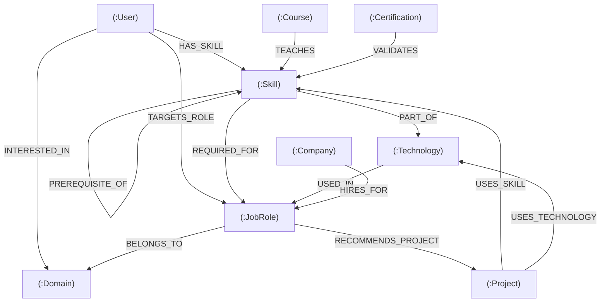

# CareerGraph — Intelligent Career & Skill Relationship Explorer

[](https://cognodb.io)
[](https://opencypher.org)
[](https://react.dev)
[](https://expressjs.com)
[](https://opensource.org/licenses/MIT)

A production-grade, graph-powered web application built for the **Wexa AI Technical Take-Home Assignment**. CareerGraph helps students and early-career developers discover realistic career trajectories, analyze skill gaps, explore multi-hop relationship pathways, and access tailored project and course recommendations powered by **CognoDB** and **openCypher**.

---

## 1. Project Overview & Problem Statement

### The Problem
Traditional job portals and career advisors treat job profiles, skills, and learning resources as isolated rows in relational tables. This leads to rigid keyword matching that fails to capture:
- **Prerequisite Dependencies:** Learning advanced tools (e.g., PyTorch, Kubernetes) requires understanding foundational concepts (Python, Docker) first.
- **Transitive Opportunities:** Skills qualify candidates for adjacent roles across high-growth domains.
- **Deep Relationship Discovery:** Explaining *why* a student is recommended a career path requires traversing 4+ degrees of connectivity (User ➔ Skills ➔ Roles ➔ Domains ➔ Companies).

### The CareerGraph Solution
CareerGraph models the tech employment ecosystem as an **interconnected knowledge graph**. Using **CognoDB**, parameterized openCypher queries, and graph topological algorithms, CareerGraph delivers:
1. **Dynamic Career Readiness Gauges:** Real-time calculation of skill match percentages.
2. **Topological Skill Gap Roadmaps:** Pedagogically ordered learning paths traversing `[:PREREQUISITE_OF]` edges.
3. **Multi-Hop Traversal Explorer:** Visual discovery of 2+ to 6-hop relationships connecting skills to hiring tech companies.
4. **Interactive Force-Directed Graph:** High-performance Canvas visualizer allowing direct node inspection, clustering, and filtering.

---

## 2. System Architecture

```
React 19 + TypeScript (Vite + Tailwind CSS v4)
               │
               ▼ (REST API JSON Payloads)
Express 4 Server (Node.js + TypeScript)
               │
               ▼ (Bolt Protocol Session Management)
Official Neo4j Driver (`neo4j-driver` v5)
               │
               ▼ (Parameterized openCypher Queries)
CognoDB Graph Database Layer (Index-Free Adjacency)
```

---

## 3. Why a Graph Database? (Graph vs Relational Breakdown)

### Relational Database Limitation (JOIN Combinatorial Blowup)
In an RDBMS (PostgreSQL/MySQL), traversing from a user's skills to adjacent domain opportunities and hiring companies requires joining 8 tables:
```sql
SELECT u.name, s.name, r1.title, d.name, r2.title, c.name, hr.salary_range
FROM users u
JOIN user_skills us ON u.id = us.user_id
JOIN skills s ON us.skill_id = s.id
JOIN role_skills rs1 ON s.id = rs1.skill_id
JOIN job_roles r1 ON rs1.role_id = r1.id
JOIN domains d ON r1.domain_id = d.id
JOIN job_roles r2 ON d.id = r2.domain_id AND r1.id <> r2.id
JOIN company_hiring hr ON r2.id = hr.role_id
JOIN companies c ON hr.company_id = c.id
WHERE u.id = $1;
```
- **Performance:** $O(N \log N)$ to $O(N^k)$ complexity. Join tables require scanning intermediate index trees.
- **Cartesian Explosion:** As dataset scales to millions of records, join buffers exhaust memory.

### CognoDB & openCypher Advantage (Index-Free Adjacency)
In **CognoDB**, graph nodes maintain direct physical memory pointers to their adjacent relationships:
```cypher
MATCH (u:User {id: $userId})-[:HAS_SKILL]->(s:Skill)-[:REQUIRED_FOR]->(r1:JobRole)-[:BELONGS_TO]->(d:Domain)
MATCH (d)<-[:BELONGS_TO]-(r2:JobRole)<-[h:HIRES_FOR]-(c:Company)
WHERE r1 <> r2
RETURN u.name, s.name, r1.title, d.name, r2.title, c.name, h.salaryRange;
```
- **Complexity:** $O(k)$ where $k$ is the local degree count. Traversal execution time is sub-millisecond and completely independent of total database size.
- **Variable-Length Traversals:** Path patterns like `[:PREREQUISITE_OF*1..3]` execute natively without recursive SQL CTEs.

---

## 4. Graph Data Model & Schema



### Node Labels
- `(:User)`: `id`, `name`, `experienceLevel`, `targetRole`, `bio`, `avatar`
- `(:Skill)`: `id`, `name`, `category`, `difficulty`, `demandScore`
- `(:Technology)`: `id`, `name`, `category`, `ecosystem`, `description`
- `(:JobRole)`: `id`, `title`, `description`, `demandLevel`, `avgSalary`, `experienceRequired`
- `(:Company)`: `id`, `name`, `industry`, `tier`, `headquarters`
- `(:Project)`: `id`, `name`, `difficulty`, `description`, `estimatedHours`, `githubUrl`
- `(:Course)`: `id`, `title`, `provider`, `level`, `rating`, `durationHours`, `url`
- `(:Certification)`: `id`, `name`, `issuer`, `validityYears`, `url`
- `(:Domain)`: `id`, `name`, `description`, `growthRate`

### Typed Relationships
- `(:User)-[:HAS_SKILL]->(:Skill)`
- `(:User)-[:INTERESTED_IN]->(:Domain)`
- `(:User)-[:TARGETS_ROLE]->(:JobRole)`
- `(:Skill)-[:PART_OF]->(:Technology)`
- `(:Skill)-[:REQUIRED_FOR { importance }]->(:JobRole)`
- `(:Skill)-[:PREREQUISITE_OF]->(:Skill)`
- `(:Technology)-[:USED_IN]->(:JobRole)`
- `(:JobRole)-[:BELONGS_TO]->(:Domain)`
- `(:Company)-[:HIRES_FOR { openPositions, salaryRange }]->(:JobRole)`
- `(:Project)-[:USES_SKILL]->(:Skill)`
- `(:Project)-[:USES_TECHNOLOGY]->(:Technology)`
- `(:JobRole)-[:RECOMMENDS_PROJECT]->(:Project)`
- `(:Course)-[:TEACHES]->(:Skill)`
- `(:Certification)-[:VALIDATES]->(:Skill)`

---

## 5. Core openCypher Queries

### Query 1: Discover Careers Matching User Skills
```cypher
MATCH (role:JobRole)
MATCH (role)<-[req:REQUIRED_FOR]-(sk:Skill)
OPTIONAL MATCH (role)-[:BELONGS_TO]->(dom:Domain)
OPTIONAL MATCH (comp:Company)-[h:HIRES_FOR]->(role)
WITH role, dom,
     collect(DISTINCT sk.id) AS allReqSkillIds,
     collect(DISTINCT {
       id: sk.id,
       name: sk.name,
       importance: req.importance,
       matched: sk.id IN $userSkillIds
     }) AS skillDetails,
     collect(DISTINCT { name: comp.name, salary: h.salaryRange }) AS companies
WITH role, dom, skillDetails, companies,
     [s IN skillDetails WHERE s.matched = true] AS matchedSkills,
     size(allReqSkillIds) AS totalCount
WHERE totalCount > 0
RETURN
  role.title AS title,
  toInteger(round((toFloat(size(matchedSkills)) / toFloat(totalCount)) * 100)) AS matchPercentage,
  matchedSkills,
  companies
ORDER BY matchPercentage DESC;
```

### Query 2: Missing Skills & Topological Learning Order
```cypher
MATCH (role:JobRole {id: $roleId})
MATCH (sk:Skill)-[req:REQUIRED_FOR]->(role)
WHERE NOT sk.id IN $userSkillIds
OPTIONAL MATCH (prereq:Skill)-[:PREREQUISITE_OF]->(sk)
OPTIONAL MATCH (crs:Course)-[:TEACHES]->(sk)
RETURN
  sk.name AS missingSkill,
  req.importance AS importance,
  collect(DISTINCT prereq.name) AS prerequisites,
  collect(DISTINCT crs) AS courses;
```

### Query 5 & 6: Variable Multi-Hop Career Traversal (2+ to 5 Hops)
```cypher
MATCH (startSkill:Skill {id: $startSkillId})
OPTIONAL MATCH (startSkill)-[:PREREQUISITE_OF*0..2]->(targetSkill:Skill)-[:REQUIRED_FOR]->(r:JobRole)
OPTIONAL MATCH (r)-[:BELONGS_TO]->(d:Domain)
OPTIONAL MATCH (c:Company)-[h:HIRES_FOR]->(r)
RETURN
  startSkill.name AS foundationSkill,
  targetSkill.name AS bridgeSkill,
  r.title AS careerDestination,
  d.name AS domain,
  collect(DISTINCT c.name) AS hiringCompanies;
```

---

## 6. Project Structure

```
careergraph/
├── client/                     # React 19 + Vite + TypeScript Frontend
│   ├── src/
│   │   ├── components/         # Layout, GraphCanvas, ReadinessGauge, LearningPathway
│   │   ├── pages/              # Dashboard, CareerExplorer, SkillGap, Paths, Graph, etc.
│   │   ├── services/           # Axios API service client
│   │   ├── types/              # TypeScript interface definitions
│   │   ├── index.css           # Tailwind CSS v4 design tokens & glassmorphism
│   │   └── main.tsx            # React entry point
│   ├── package.json
│   └── vite.config.ts
│
├── server/                     # Node.js + Express + TypeScript Backend
│   ├── src/
│   │   ├── db/                 # CognoDB driver manager, seeder, in-memory fallback
│   │   ├── queries/            # Parameterized openCypher queries
│   │   ├── controllers/        # REST API route controllers
│   │   ├── routes/             # API endpoint routes
│   │   ├── middleware/         # Safe error handlers
│   │   └── server.ts           # Express server entry point
│   ├── package.json
│   └── tsconfig.json
│
├── scripts/
│   └── seed.ts                 # Standalone CognoDB database seed script
│
├── docs/
│   ├── graph-model.md          # Full Graph Schema reference
│   └── interview-guide.md      # Line-by-line interview talking points
│
├── .env.example                # Safe environment variable template
├── .gitignore
├── package.json                # Root orchestration package.json
└── README.md
```

---

## 7. Local Development Setup

### Prerequisites
- Node.js v18+ or v22+
- npm v9+

### Step 1: Clone Repository & Install Dependencies
```bash
git clone https://github.com/your-username/careergraph.git
cd careergraph

# Install root, backend, and frontend packages
npm install
cd server && npm install
cd ../client && npm install
cd ..
```

### Step 2: Configure Environment Variables
Copy `.env.example` to `server/.env`:
```env
PORT=5000
CLIENT_URL=http://localhost:5173

# CognoDB Instance Credentials (Leave empty to use automatic high-fidelity in-memory engine)
COGNODB_URI=bolt+s://your-instance.cognodb.io:7687
COGNODB_USERNAME=cognodb
COGNODB_PASSWORD=your-secure-password
COGNODB_DATABASE=neo4j
```

### Step 3: Seed Database (Optional for CognoDB Cloud)
```bash
npm run seed
```

### Step 4: Run Application Locally
```bash
npm run dev
```
- **Frontend Dashboard:** [http://localhost:5173](http://localhost:5173)
- **Backend REST API:** [http://localhost:5000/api/health](http://localhost:5000/api/health)

---

## 8. REST API Documentation

| Method | Endpoint | Description |
| :--- | :--- | :--- |
| `GET` | `/api/health` | Health check & database connection status |
| `GET` | `/api/users` | List demo student user profiles |
| `GET` | `/api/skills` | List all verified skills |
| `GET` | `/api/job-roles` | List all job roles with domains and required skills |
| `POST`| `/api/careers/recommendations` | Query 1: Discover matching jobs for input skills |
| `POST`| `/api/skill-gap` | Query 2: Analyze skill gaps and build topological DAG roadmap |
| `POST`| `/api/recommendations/role` | Query 3 & 4: Get recommended projects & courses |
| `GET` | `/api/career-path/:skillId` | Query 5 & 6: Multi-hop career path traversal |
| `GET` | `/api/graph/subgraph` | Query 7: Extract subgraph for interactive Canvas |
| `GET` | `/api/careers/:roleId/alternatives` | Query 8: Alternative career pivots sharing high skill overlap |
| `POST`| `/api/cypher/benchmark` | Critical Query: 6-Hop Graph vs 8-Table SQL JOIN comparison |
| `POST`| `/api/cypher/run` | Safe read-only Cypher execution playground |

---

## 9. Visual Screenshots

| View | Description |
| :--- | :--- |
| **Dashboard** | Career readiness radial gauge, active user profile, target role breakdown, verified vs missing skills. |
| **Career Explorer** | Domain filtering, real-time match %, interactive skill simulator, hiring companies. |
| **Skill Gap Analyzer** | Target role selection, prerequisite DAG learning sequence, course recommendations. |
| **Career Path Explorer** | Multi-hop pathway breadcrumbs from foundational skills to high-paying careers. |
| **Graph Explorer** | Full-screen interactive force-directed canvas with node inspector and label filters. |
| **Query Lab** | Side-by-side SQL vs openCypher benchmark analysis and live Cypher runner. |

---

## 10. Free Deployment Instructions

### Deploy Frontend (Vercel / Netlify)
1. Set Root Directory: `client`
2. Build Command: `npm run build`
3. Output Directory: `dist`

### Deploy Backend (Render / Railway)
1. Set Root Directory: `server`
2. Build Command: `npm run build`
3. Start Command: `npm start`
4. Set Environment Variables: `COGNODB_URI`, `COGNODB_USERNAME`, `COGNODB_PASSWORD`, `PORT=5000`.

---

## 11. License
MIT License © 2026 CareerGraph Team. Built for the Wexa AI Technical Take-Home Assignment.
