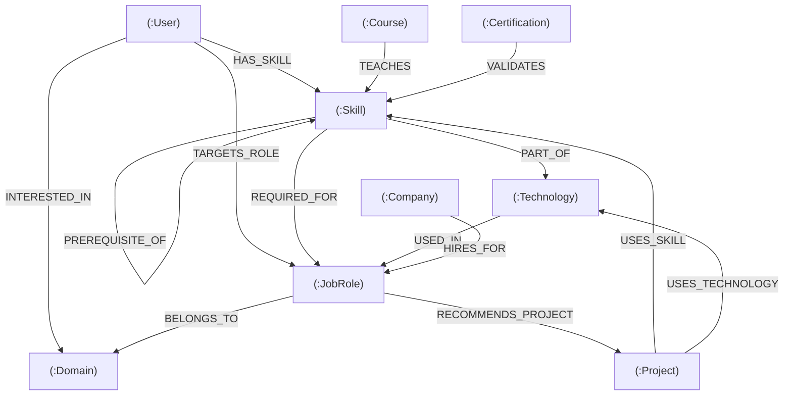

# CareerGraph — Graph Data Model & openCypher Schema Specification

CareerGraph uses **CognoDB** (compatible with openCypher and Bolt protocol) to represent the high-dimensional web of skills, technologies, job roles, learning paths, and tech company hiring requirements.

---

## 1. Graph Data Model Diagram



---

## 2. Node Labels and Properties

| Node Label | Key Properties | Purpose & Semantic Role |
| :--- | :--- | :--- |
| `(:User)` | `id`, `name`, `experienceLevel`, `targetRole`, `bio`, `avatar` | Represents a student or job seeker exploring career transitions. |
| `(:Skill)` | `id`, `name`, `category`, `difficulty`, `demandScore` | Atomic technical capabilities (e.g., Python, Docker, PyTorch). |
| `(:Technology)` | `id`, `name`, `category`, `ecosystem`, `description` | Broader tech ecosystems and runtime platforms. |
| `(:JobRole)` | `id`, `title`, `description`, `demandLevel`, `avgSalary`, `experienceRequired` | Standardized industry job titles with salary ranges and difficulty. |
| `(:Company)` | `id`, `name`, `industry`, `tier`, `headquarters` | Tech giants, high-growth startups, and enterprises actively hiring. |
| `(:Project)` | `id`, `name`, `difficulty`, `description`, `estimatedHours`, `githubUrl` | Hands-on portfolio capstone projects designed to develop skills. |
| `(:Course)` | `id`, `title`, `provider`, `level`, `rating`, `durationHours`, `url` | Online learning courses from Coursera, DeepLearning.AI, Stanford, etc. |
| `(:Certification)` | `id`, `name`, `issuer`, `validityYears`, `url` | Industry-standard credentials validating verified competencies. |
| `(:Domain)` | `id`, `name`, `description`, `growthRate` | High-level market sectors (AI/ML, Cloud, Web, Security, FinTech). |

---

## 3. Typed Relationships and Properties

| Relationship Type | Source ➔ Target | Properties | Semantic Meaning |
| :--- | :--- | :--- | :--- |
| `[:HAS_SKILL]` | `(:User) ➔ (:Skill)` | `proficiency` | The student currently possesses this verified skill. |
| `[:INTERESTED_IN]` | `(:User) ➔ (:Domain)` | — | The student expresses career interest in this market domain. |
| `[:TARGETS_ROLE]` | `(:User) ➔ (:JobRole)` | — | The primary target career role the student is aiming for. |
| `[:PART_OF]` | `(:Skill) ➔ (:Technology)` | — | Classifies skill into a technology stack. |
| `[:REQUIRED_FOR]` | `(:Skill) ➔ (:JobRole)` | `importance` (`Must-Have`, `Good-to-Have`) | Qualification criteria for a career role. |
| `[:PREREQUISITE_OF]`| `(:Skill) ➔ (:Skill)` | — | Directed Acyclic Graph (DAG) for pedagogical learning sequences. |
| `[:USED_IN]` | `(:Technology) ➔ (:JobRole)`| — | Technology stack utilized in day-to-day role operations. |
| `[:BELONGS_TO]` | `(:JobRole) ➔ (:Domain)` | — | Domain classification of the career role. |
| `[:HIRES_FOR]` | `(:Company) ➔ (:JobRole)` | `openPositions`, `salaryRange` | Active job openings and verified compensation packages. |
| `[:USES_SKILL]` | `(:Project) ➔ (:Skill)` | — | Skills practiced when completing this portfolio project. |
| `[:USES_TECHNOLOGY]`| `(:Project) ➔ (:Technology)`| — | Core technology frameworks utilized in the project repository. |
| `[:RECOMMENDS_PROJECT]`| `(:JobRole) ➔ (:Project)`| — | Best capstone projects recommended for this specific role. |
| `[:TEACHES]` | `(:Course) ➔ (:Skill)` | — | Academic or industry curriculum covering this skill. |
| `[:VALIDATES]` | `(:Certification) ➔ (:Skill)`| — | Exam credential confirming verified practitioner capability. |

---

## 4. Core openCypher Queries

### Query 1: Multi-Criteria Career Matching
```cypher
MATCH (role:JobRole)
MATCH (role)<-[req:REQUIRED_FOR]-(sk:Skill)
OPTIONAL MATCH (role)-[:BELONGS_TO]->(dom:Domain)
OPTIONAL MATCH (comp:Company)-[h:HIRES_FOR]->(role)
WITH role, dom,
     collect(DISTINCT sk.id) AS allReqSkillIds,
     collect(DISTINCT {
       id: sk.id,
       name: sk.name,
       importance: req.importance,
       matched: sk.id IN $userSkillIds
     }) AS skillDetails,
     collect(DISTINCT { name: comp.name, tier: comp.tier, salary: h.salaryRange }) AS companies
WITH role, dom, skillDetails, companies,
     [s IN skillDetails WHERE s.matched = true] AS matchedSkills,
     size(allReqSkillIds) AS totalCount
WHERE totalCount > 0
RETURN
  role.title AS title,
  toInteger(round((toFloat(size(matchedSkills)) / toFloat(totalCount)) * 100)) AS matchPercentage,
  matchedSkills,
  companies
ORDER BY matchPercentage DESC;
```

### Query 2: Topological Skill Gap Roadmap
```cypher
MATCH (role:JobRole {id: $roleId})
MATCH (sk:Skill)-[req:REQUIRED_FOR]->(role)
WHERE NOT sk.id IN $userSkillIds
OPTIONAL MATCH (prereq:Skill)-[:PREREQUISITE_OF]->(sk)
OPTIONAL MATCH (crs:Course)-[:TEACHES]->(sk)
RETURN
  sk.name AS missingSkill,
  req.importance AS priority,
  collect(DISTINCT prereq.name) AS prerequisitesToSatisfyFirst,
  collect(DISTINCT crs.title) AS recommendedCourses;
```

### Query 5 & 6: Variable Multi-Hop Career Traversal (2+ to 5 Hops)
```cypher
MATCH (startSkill:Skill {id: $startSkillId})
OPTIONAL MATCH (startSkill)-[:PREREQUISITE_OF*0..2]->(targetSkill:Skill)-[:REQUIRED_FOR]->(r:JobRole)
OPTIONAL MATCH (r)-[:BELONGS_TO]->(d:Domain)
OPTIONAL MATCH (c:Company)-[h:HIRES_FOR]->(r)
RETURN
  startSkill.name AS foundationSkill,
  targetSkill.name AS bridgeSkill,
  r.title AS careerDestination,
  d.name AS domain,
  collect(DISTINCT c.name) AS hiringCompanies;
```
